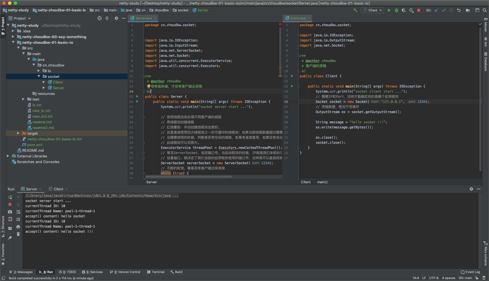

## 2. Socket基础

### **什么是socket？**

”Socket“原意”插座“的意思，在计算机领域中，翻译为”套接字“。本质上是计算机之间进行通信的一种方式。通过Socket这种约定，则一台计算机可以接收其他计算机的数据，也可以向其他计算机发送数据。

最广泛的领域是WEB领域，在WEB领域中，有一个浏览器和一个服务器，浏览器收到我们输入的url以及发送的请求，然后发送给服务端，服务端接收到这个请求，找到对应的处理进程， 处理进程会将处理好的结果返回给浏览器，浏览器再进行渲染。整个这一个过程都是Socket的应用。

有其要强调在Linux系统中的Socket，如果Java是一切皆对象，那么Linux就是一切皆文件（为了统一对各种硬件的操作，简化接口的流程，所以将一切都看做是文件的操作，包括对磁盘上文件的操作以及网络传输的操作，它会映射给每一个文件一个ID，这个ID叫做”文件描述符“）。当处理网络连接的时候也会看成是一个文件，也会有”文件描述符“，有了文件描述符后，就可以使用普通的文件操作来传输数据了（包括read()，write()等等方法）。所以，网络编程在Linux系统中，实际上就是文件操作。**怎么理解呢？**比如read()/write()，原先我们认为是从磁盘上读，写入到磁盘。现在就是从这台计算机读，写入到另一台计算机。这样不就抽象成文件操作了吗，这样也就是用read()/write()实现了远程计算机的交互。

**OSI七层网络模型**：Open System Interconnection 开放式系统互联。

```
* 从下到上分别为：
	  物理层  数据链路层  网络层  传输层  会话层  表示层  应用层
* OSI是存在于概念和理论上的一种网络模型，实际上并没有什么用，因为分层比较多，网络的工作比较复杂。
* 后来人们对其进行优化，合并了一些层，最终保留了4层，也就是我们现在最常用的TCP/IP模型。
* TCP/IP模型（4层）：
	 网络接口层或称链路层：包括原先的物理层 + 数据链路层
               网络层：包括原先的网络层
               传输层：包括原先的传输层
               应用层：包括原先的会话层 + 表示层 + 应用层
	& 应用层协议：http、ftp、smtp(邮件协议) 等等
	& 传输层协议：tcp、udp 等等
* 平时使用的程序，都是先通过应用层来访问网络的，程序产生的数据是逐层向下传输的(应用层->传输层->网络层->链路层)。每到一层会给数据增加一个数据头(标识，标识数据经过了这一层)，然后数据拆包(也就是其他计算机接收到这个数据的时候重新解析的时候，会把数据头解析出来，在逐层解析链路层->网络层->传输层->应用层)，拿到应用层的最原始的数据。
* 实际上在互联网中传输一个数据是很复杂的，但是我们是感受不到的。这就是网络模型给我们封装的比较好的一种方式。
* Socket位于传输层和引用层之间的一种抽象层。也就是，Socket实际上是一组接口，对应到设计模式中就是门面设计模式。
* 会将比较复杂的TCP/IP协议隐藏在Socket接口后面。我们只需要调用Socket去组装数据就可以了。
```

**Socket其实是应用层与传输层之间的抽象层， 是一组接口。在设计模式中，对应的是门面模式。**

```
门面模式：
	举例：医院。
* 到医院看病，通常：挂号、缴费、化验、取药等等一系列的流程。要和各个部门打交道。
* 如果使用门面模式，对应就是有一个接待员帮我们能做这一系列事情，那么我们到医院看病的流程也就简单了很多。
* 这样可以映射为，我们使用Socket去处理网络连接的时候，相当于帮我们做了一层封装。
```

### Socket

两个程序通过双向的连接进行数据的交换，双向链路的一端，称为Socket。
Socket由IP地址(确定物理机器)和端口号(确定该机器上的进程)唯一确定，在java环境中，主要指基于TCP/IP协议的网络编程。

**使用方式：**

```abap
* 服务端
1）服务端创建ServerSocket,  调用accept()方法来接收客户端的连接。
	& 这相当于是一种阻塞的方式，不断的等待客户端的连接
2）客户端创建Socket,  请求和服务端建立连接，传输数据。
3）当服务端接收到客户的连接后，创建一个新的Socket与客户端连接，服务端继续等待新的请求。
```

```abap
* 客户端
1）创建Socket
2）打开连接的输入/输出流
3）按照协议对Socket进行读写操作
	& 此时的读写都是和远程的计算机进行交互的。
4）关闭Socket
```

```java
package cn.zhoudbw.socket02;


import java.io.IOException;
import java.io.InputStream;
import java.net.ServerSocket;
import java.net.Socket;
import java.util.concurrent.ExecutorService;
import java.util.concurrent.Executors;

/**
 * @author zhoudbw
 * 现有服务端，才会有客户端去连接
 */
public class Server {
    public static void main(String[] args) throws IOException {
        System.out.println("socket server start ...");

        // 使用线程池来处理不同客户端的线程
        // 用线程池创建线程
        // 红线警告：手动创建线程池会更好。
        // 这里直接使用四大线程池之一的可缓冲的线程池：如果当前线程数量超过需要使用的线程数，回收空闲的线程。
        // 当需要使用的时候，判断是否有空闲的线程，如果有直接复用，如果没有自动创建。
        // 此线程池可以无限大。
        ExecutorService threadPool = Executors.newCachedThreadPool();
        // 常见ServerSocket，设定端口号。当启动程序的时候，IP就是我们本机的IP，已经确定了。
        // 设置端口，就决定了我们当前的应用程序使用的端口号，这样就可以直接找到这个应用程序了。
        ServerSocket serverSocket = new ServerSocket(1234);
        // 不断的轮询，看是否有客户端过来连接
        while (true) {
            // 发现有客户端的连接，我们需要处理
            // 等待客户端连接，是阻塞的接收方式
            // 接收到客户端的连接后，我们创建Socket(此时通过accept()方法得到的Socket，映射的就是客户端的Socket)
            /* 增加final修饰符，代表不可变，确保线程安全*/
            final Socket socket = serverSocket.accept();
            // 通过线程池创建处理线程，来处理接收到的客户端的连接
            threadPool.execute(new Runnable() {
                @Override
                public void run() {
                    // 处理Socket
                    handler(socket);
                }

                // 封装Socket的处理方法(和客户端通信的处理逻辑)
                private void handler(Socket socket) {
                    System.out.println("currentThread ID: " + Thread.currentThread().getId());
                    System.out.println("currentThread Name: " + Thread.currentThread().getName());
                    // 接收客户端传递的数据
                    // 因为此时还是IO操作，所以我们使用字节数据
                    byte[] bytes = new byte[1024];
                    // 通过socket拿到输入流(通过socket获取到的输入流，实际上就是客户端的输入流)
                    InputStream is = null;
                    try {
                        is = socket.getInputStream();
                        // 读取客户端传递过来的数据
                        for (; ; ) {
                            int read = is.read(bytes);
                            if (read == -1) {
                                // 读完成
                                break;
                            }
                            //未读完，打印内容 (new String(byte[], offset, length))
                            System.out.println("accept() content: " + new String(bytes, 0, read));
                        }
                    } catch (IOException e) {
                        e.printStackTrace();
                    } finally {
                        // 不论是否抛出异常，都要关闭socket
                        try {
                            assert is != null;
                            is.close();
                            socket.close();
                        } catch (IOException e) {
                            e.printStackTrace();
                        }
                    }
                }
            });
        }
    }
}
```

```java
package cn.zhoudbw.socket02;

import java.io.IOException;
import java.io.OutputStream;
import java.net.Socket;

/**
 * @author zhoudbw
 * 客户端的逻辑
 */
public class Client {

    public static void main(String[] args) throws IOException {
        System.out.println("socket client start ...");
        // 需要IP和Port，这样才能确定找的是哪个应用程序
        Socket socket = new Socket("127.0.0.1", 1234);
        // 传输数据，相当于写操作
        OutputStream os = socket.getOutputStream();

        String message = "hello socket !!!";
        os.write(message.getBytes());

        os.close();
        socket.close();
    }
}
```

