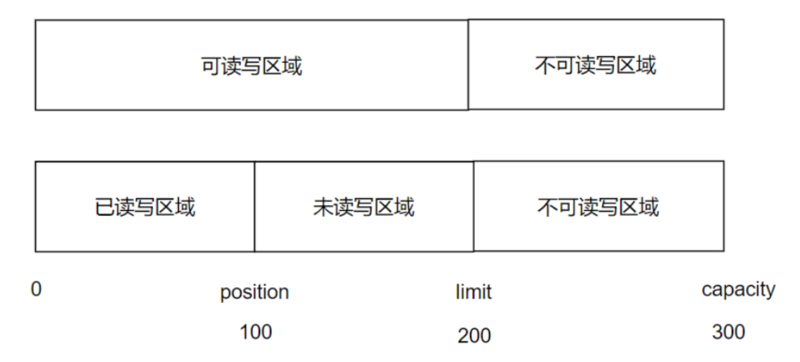
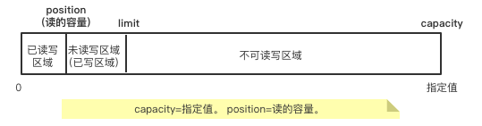

## 3. NIO基础

我们前面所使用的IO在对应的是BIO：BlockingIO 同步阻塞。

NIO是在JDK1.4的时候推出的，当时认为称其为NewIO，众所周知JDK1.4已经不是一个新的版本了，现在我们通用的是JDK8，新版本都已经推出JDK13了，现在我们更习惯将NIO成为Non-BlockingIO 同步非阻塞。

对应还有AIO：AsynchronousIO 异步非阻塞。

### **BIO、NIO、AIO三者有什么区别？**

```abap
不论是同步or异步or阻塞or非阻塞，都是我们在处理某一问题的不同应对方案所定义的一个概念。
面临任务依赖关系时，采用的不同的解决方案，分为同步和异步。
面对CPU处理时，采用的不同的解决方案，分为阻塞和非阻塞。
* 比如：
*** 同步：
     & 当A任务依赖B任务时，如果B任务完成之后，A任务才完成，这种我们认为是同步的关系。
     & 任务A和任务B要么都成功，要么都失败。
*** 异步：
     & 当A任务依赖B任务时，通知B任务开始启动，A任务完成即为完成，相对不可靠
----  
  && 生活中来理解同步和异步：
   & 早期去银行办理业务，直接排长队，轮到自己的时候就去办理业务。
   & 后来演变为有一个取号机，当需要办理业务的时候，直接去取号机取号码，轮到自己号码的时候，会有广播通知轮到自己了。
   & 这其实就相当于是从同步到异步的一个转变。
   & 同步是说，办理业务这个事情是要依赖于排队这个事情的，排到自己了才可以去办理业务，这是两个任务之间的依赖关系。
   & 异步是说，要去办理业务的时候，先领取号码，之后会有一个广播通知，可以通知当前号码是否可以办理业务，如果到达自己了，再去办理业务；
   &    不是一种强依赖的关系。这会出现一个问题，就是错过这个通知，就没有去办理成这个业务，这时可能就需要重新去等待了。
   &    这也说明了，同步是相对可靠的，已不是相对不可靠的。
   &    异步中出现了一种通知机制，当任务A依赖于任务B的时候，任务B已经开始启动了，然后通知任务B已经完成，然后判断任务A完成。
   & 在上述举例中，任务A相当于办理业务，任务B相当于排队。
   
   & 在同步中，站着排队，排到自己办理业务，办理完成，流程结束。
   & 在异步中，取号码，等待业务通知自己，通知到自己就办理业务，办理完成，流程结束。

----
*** 阻塞：
     & 面向CPU，等待慢操作完成才切换
*** 非阻塞： 
     & 面向CPU，在慢操作执行时，去做别的事儿，等慢操作完成后切换回来
  && 阻塞和非阻塞是面向CPU处理来说的。
   & 对于单核机器来说，CPU处理进程的时候，不同进程往往是要来回切换的。某一个时间点只处理一个进程。
   & 我们之所以感觉我们同一时间做了好多的事情，如同时听歌，coding...，是因为CPU可以快速的切换进程，这个切换我们感知不到。
   & 当CPU处理一个操作的时候，这个操作比较耗时，我们称之为慢操作。
   & 如果我们需要等待慢操作执行完毕才能够切换，此时对CPU的利用率很低。此时这种状态我们称之为阻塞的状态。
   & 如果有慢操作的时候，我们先去做别的事情，等慢操作完成后我们再切换回来，这种状态我们成为非阻塞的状态。
  && 生活中来理解阻塞和非阻塞：
   & 到银行办业务。不论选择排队，还是取号机取号。
   & 如果在这个等待的过程中没法做其他的事情，那么都是阻塞的状态的。
   & 如果在这个等待的过程中做其他的事情（如打电话，处理工作等等），当通知到自己或者排队轮到自己再去做业务的事情，这样就是非阻塞的状态。
   & 不论是同步还是异步，都有可能出现阻塞和非阻塞的状态。
   & 阻塞效率是非常低下的，因为在这个漫长的等待中，什么也做不了。
   & 非阻塞效率较高，因为在这个漫长的等待中，可以做其他的事情。
----
  && 我们以上述的例子来说明BIO、NIO、AIO：
  BIO：排队等待的过程中，什么也做不了。
  NIO：排队等待的过程中，可以做其他的事情（打电话，玩游戏...），但是要一直观察有没有轮到自己办理业务。
   & 同步非阻塞相比起同步阻塞，性能提高了很多，但是效率仍然低下。
  AIO：此时不需要一直站在这里排队了，有一个取号机的号码，当到这个号的时候会主动通知自己，不用一直观察是否到自己，在这个等待的过程中可以做其他事情。
   & 异步非阻塞是处理问题中，最高效的一种选择。
```

* **同步和异步关注的是消息通知的机制。**
  * 同步没有通知，要一直等着，一直观察。
  * 异步有通知，并且是主动通知。
* **阻塞和非阻塞关注的是等待消息过程中的状态**。
  * 不论在等待过程中，有没有主动的通知到自己，在这个过程中有没有做其他的事。
    * 没有：阻塞
    * 有：非阻塞

* 再举个例子：

  * ```
    * 利用电脑下载东西：
    	& 同步阻塞BIO：点击下载之后，就一直盯着进度条看，什么也不做，盯着等下载完。
    	& 同步非阻塞NIO：点击下载之后，去做别的事情，时不时回来看一眼有没有下载完。
    	& 异步非阻塞AIO：点击下载之后，去做别的事情，不需要自己观察，下载完了会主动提醒我们下载完。
    ```

### NIO核心

NIO是由三大元素组成的，分别是通道channel、缓冲区buffer、选择器selector。


```
BIO vs NIO
 * BIO是面向流的
 * NIO是面向块的（使用缓冲区，不是一个字节一个字节的处理，而是一块一块的处理）
 最大不同在于，NIO将文件或文件中的一段区域映射到内存中，可以像访问内存一样访问文件，这样极大的提高了访问效率。
 NIO的这种使用方式称之为”多路复用“。
```

<div align="center" style="font-size:0.8em">表 NIO和BIO的元素对应关系</div>

| NIO             | BIO             |
| --------------- | --------------- |
| Channel 通道    | Stream          |
| Buffer 缓冲区   | byte[] / char[] |
| Selector 选择器 |                 |

```
在BIO中，Stream既处理数据，有连通数据，Channel在这里是从节点读取数据的通道，主要是通道的作用。
和Stream的不同在于Channel是双向的，既可以输入又可以输出，而Stream是单向的分为输入流和输出流。
Channel的获取是通过Stream来获取的。

在BIO中，我们使用byte[]或char[]来批量的处理数据，
所以在NIO中直接使用Buffer，相当于byte[]，可以在通道之间进行批量的数据传输。
注意：通道不是用来处理数据的，通道只是用来连接数据的渠道，处理数据使用的是Buffer。

Selector是通知机制的核心要义。用来监测多个通道上是否有IO事件(读事件、写事件、连接时间)发生，
如果有(往往多个通道上，不会同时发生IO事件的)就会触发通知，当某个通道发生IO事件会分配一个线程去处理，这也是多路复用的原理所在。
这样的好处就是，使用一个线程可以去处理多个通道上的IO事件。
如果没有持续监测。
```

<div align="center" style="font-size:0.8em">图 BIO对于IO事件的处理机制</div>


显然，每一个IO便分配一个线程去处理，严重的资源浪费。

<div align="center" style="font-size:0.8em">图 NIO对于IO事件的处理机制</div>


#### 1）Channel

| Channel实现类                            | 作用                  |
| :--------------------------------------- | --------------------- |
| FileChannel                              | 文件数据的通道        |
| Pipe.SinkChannel<br />Pipe.SourceChannel | 线程间通信的通道      |
| ServerSocketChannel                      | ServerSocket的管道    |
| SocketChannel                            | 用于TCP网络通信的通道 |
| DatagramChannel                          | 用于UDP网络通信的通道 |

```java
package cn.zhoudbw.nio03;

import java.io.File;
import java.io.FileOutputStream;
import java.io.IOException;
import java.io.OutputStream;
import java.nio.ByteBuffer;
import java.nio.channels.FileChannel;

/**
 * @author zhoudbw
 *
 */
public class ChannelTest {
    public static void main(String[] args) throws IOException {
        String basePath = "netty-zhoudbw-01-basic-io/src/";
        File file = new File(basePath + "nio.txt");
        if (!file.exists()) {
            System.out.println("nio.txt does not exists : create new file.");
            file.createNewFile();
        }
        OutputStream os = new FileOutputStream(file);
        // 通过FileOutputStream获取FileChannel (通过Stream获取Channel)
        FileChannel fileChannel = ((FileOutputStream)os).getChannel();
        // 使用Buffer来处理数据
        // 通过ByteBuffer这个具体的实现类，分配一个1024大小的缓冲区
        ByteBuffer buffer = ByteBuffer.allocate(1024);
        // 设置要写入nio.txt的内容
        String str = "hello nio";
        // 将字节数据放入到缓冲区
        buffer.put(str.getBytes());

        // 放入完成，需要调用flip()方法刷新
        buffer.flip();
        // 将缓冲区的内容，通过通道写入文件中
        fileChannel.write(buffer);

        // 关闭
        fileChannel.close();
        os.close();
    }
}
```

#### 2） Buffer

Buffer底层是数组结构，可以进行get/set操作。因为Buffer本质上是已经声明的数组，所以不能new创建对象，所以Buffer没有构造器，使用时通过XxxBuffer.allocate(int capacity)方法进行分配数组容量 —— 创建容量为capacity的对象。

Buffer中有三个重要的参数：capacity 容量、limit 界限、position 位置。通过Buffer的内存模型图具体看一看。



按照上图来说：

```
* 创建Buffer的时候，为Buffer分配容量为（capacity）300 —— 总体容量大小。
* 根据数据存储位置的不同，将Buffer又分为可读写区域和不可读写区域，limit是可读写和不可读写的分界线。
* 根据已读容量的大小（position）100，又将可读写区域划分为已读写区域和未读写区域，两者的分界线是position。

* 直观比喻：我们将Buffer看做是一个邮箱。
* 可读写区域就是我们的收件箱，存储我们想看的内容；
* 不可读写区域就是我们的垃圾箱，存储我们不想看的内容。
* 在收件箱中，邮件又有已读和未读的区别。
* 又将可读写区域划分为了已读写区域和未读写区域。
```

##### 使用原理

a) 初始化时，给定容量capacity。此时，并未存储数据。Buffer内存模型反应出来的就是一整块（未划分区域）。

```
此时参数的值：
capacity=指定值。 limit=capacity。 position=0。
```


* 已读写区域 | 未读写区域 | 不可读写区域 的划分不是通过capacity、position、limit的数量关系确定的。而是通过是否执行了读操作和写操作确定的。
* 该区域执行了写操作，没有进行读操作依旧属于未读写区域。
* 该区域执行了写操作，也执行了读操作，该区域属于已读写区域。
* 该区域既没有执行读操作也没有执行写操作，该区域属于不可读写区域。

b) 当时用put()方法存入数据时，通过position来记录存储的容量变化，position不断的后移，知道存储结束（写完成）。

```
此时参数值，并未完全刷新。
```


c) 写完成需要调用flip方法刷新，刷新的capacity、position、limit的值。
    flip()方法还起到读写切换的作用。

```
* position是用来记录存储容量的变化的
* limit = position 这样limit就能够记录当前可读写区域的大小。
* position是从0开始移动，随着put()方法的调用，position逐渐后移。
* 后移带来的直观反应便是未读写区域(已写区域）变大。
* limit = position，自然limit的大小便是未读写区域(已写区域）的大小。

* 将 position置为0，即position=0。
* 因为此时还没有读操作，所以将已读部分重置为空。
```


d) 读数据是，position不断的向后移动，直到读完成。



e) 读完成（读完成指的是可读写区域没有未读的数据）调用clear方法，重置position和limit的位置。position=0，limit=capacity。


* 也许你会疑问为什么要重置呢？不是说position是已读写区域与未读写区域的分界线，limit是可读写区域和不可读写区域的分界线么？
* 确实如此，从d)中的Buffer内存模型就可以看出这一点来。
* 但是我们要注意一个事情，Buffer只是个缓冲区，数据来源都是通过channel传递进来的。
* 缓冲区得有东西才能读，这需要写操作。当把Buffer中的数据都读完了，不重置，干嘛呢。

```java
package cn.zhoudbw.nio03;

import java.nio.CharBuffer;

/**
 * @author zhoudbw
 * NIO的Buffer内存模型值的读写校验
 */
public class BufferTest {

    public static void main(String[] args) {

        System.out.println("、、、、、、、初始化Buffer、、、、、、、");
        CharBuffer charBuffer = CharBuffer.allocate(8);
        System.out.println("capacity：" + charBuffer.capacity());
        System.out.println("limit：" + charBuffer.limit());
        System.out.println("position：" + charBuffer.position());

        System.out.println("、、、、、、、存入t & i & a & n 这四个字母、、、、、、、");
        charBuffer.put('t');
        charBuffer.put('i');
        charBuffer.put('a');
        charBuffer.put('n');
        System.out.println("capacity：" + charBuffer.capacity());
        System.out.println("limit：" + charBuffer.limit());
        System.out.println("position：" + charBuffer.position());

        System.out.println("、、、、、、、调用flip()、、、、、、、");
        charBuffer.flip();
        System.out.println("capacity：" + charBuffer.capacity());
        System.out.println("limit：" + charBuffer.limit());
        System.out.println("position：" + charBuffer.position());

        System.out.println("、、、、、、、读取数据，0号位置、、、、、、、");
        // get() || get(int index) 不传参代表获取第一个，传参代表指定索引位置
        // 调用get()时，即不传参时，position的值变化。
        // 调用get(int index)时，即传参，position的值不变化。
        System.out.println(charBuffer.get());
        System.out.println("capacity：" + charBuffer.capacity());
        System.out.println("limit：" + charBuffer.limit());
        System.out.println("position：" + charBuffer.position());

        System.out.println("、、、、、、、读取数据，2号位置、、、、、、、");
        System.out.println(charBuffer.get(2));
        System.out.println("capacity：" + charBuffer.capacity());
        System.out.println("limit：" + charBuffer.limit());
        System.out.println("position：" + charBuffer.position());

        System.out.println("、、、、、、、遍历charBuffer、、、、、、、");
        // buffer.hasRemaining()方法，可以判断Buffer中是否还有值
        // 如果遍历发生在clear之后，会打印出空的char，因为此时limit=capacity。position=0。
        while (charBuffer.hasRemaining()) {
            // get()不传参的第一个位置，position所在位置的值。
            System.out.println(charBuffer.get());
        }

        System.out.println("、、、、、、、调用clear()方法、、、、、、、");
        // clear()方法重置的是索引位置，对象依然存在，想要获取数据依旧可以。
        charBuffer.clear();
        System.out.println("capacity：" + charBuffer.capacity());
        System.out.println("limit：" + charBuffer.limit());
        System.out.println("position：" + charBuffer.position());

    }
}
————————————————————————————————————————————————————————————
  输出结果：
  、、、、、、、初始化Buffer、、、、、、、
  capacity：8
  limit：8
  position：0
  、、、、、、、存入t & i & a & n 这四个字母、、、、、、、
  capacity：8
  limit：8
  position：4
  、、、、、、、调用flip()、、、、、、、
  capacity：8
  limit：4
  position：0
  、、、、、、、读取数据，0号位置、、、、、、、
  t
  capacity：8
  limit：4
  position：1
  、、、、、、、读取数据，2号位置、、、、、、、
  a
  capacity：8
  limit：4
  position：1
  、、、、、、、遍历charBuffer、、、、、、、
  i
  a
  n
  、、、、、、、调用clear()方法、、、、、、、
  capacity：8
  limit：8
  position：0
```

```java
package cn.zhoudbw.nio03;

import java.nio.CharBuffer;

/**
 * @author zhoudbw
 * Buffer的mark()和reset()方法。
 * mark()标记position的位置
 * reset()恢复到mark的position位置
 */
public class BufferTest2 {
    public static void main(String[] args) {

        CharBuffer charBuffer = CharBuffer.allocate(8);
        charBuffer.put('t');
        charBuffer.put('i');
        charBuffer.put('a');
        charBuffer.put('n');
        charBuffer.flip();


        System.out.println("flip() over -> position：" + charBuffer.position());

        /**
         * mark() and reset()
         */
        System.out.println("、、、、、、、读取数据，0号位置，因为此时的position==0、、、、、、、");
        System.out.println(charBuffer.get());
        System.out.println("capacity：" + charBuffer.capacity());
        System.out.println("limit：" + charBuffer.limit());
        System.out.println("position：" + charBuffer.position());

        // 标记此位置position，也就是标记了position==0的位置（存储当前位置）
        charBuffer.mark();

        System.out.println("、、、、、、、读取数据，1号位置， 因为此时position==1、、、、、、、");
        System.out.println(charBuffer.get());
        System.out.println("capacity：" + charBuffer.capacity());
        System.out.println("limit：" + charBuffer.limit());
        System.out.println("position：" + charBuffer.position());

        System.out.println("、、、、、、、调用reset()、、、、、、、");
        // 回退（重置）
        charBuffer.reset();
        System.out.println("capacity：" + charBuffer.capacity());
        System.out.println("limit：" + charBuffer.limit());
        System.out.println("position：" + charBuffer.position());
        /**
         * 此时 position的值和mark()的值一致，相当于中间读取1号位置的代码没有作用一样
         * 没有改变position的值。
         */
    }
}
————————————————————————————————————————————————————————————
  输出结果：
  flip() over -> position：0
  、、、、、、、读取数据，0号位置，因为此时的position==0、、、、、、、
  t
  capacity：8
  limit：4
  position：1
  、、、、、、、读取数据，1号位置， 因为此时position==1、、、、、、、
  i
  capacity：8
  limit：4
  position：2
  、、、、、、、调用reset()、、、、、、、
  capacity：8
  limit：4
  position：1
```

##### flip()、clear()、mark()、reset()源码

```java
    public final Buffer flip() {
        limit = position;
        position = 0;
        mark = -1;
        return this;
    }

    public final Buffer clear() {
        position = 0;
        limit = capacity;
        mark = -1;
        return this;
    }

    public final Buffer mark() {
        mark = position;
        return this;
    }

    public final Buffer reset() {
        int m = mark;
        if (m < 0)
            throw new InvalidMarkException();
        position = m;
        return this;
    }
```

#### 3）Selector

BIO是一个线程处理一个IO通道，所以多个IO通道是由多个线程处理的，这样就带来了资源的消耗。
NIO通过Selector选择器，做到了多路复用。让多个IO通道都可以有一个Selector监听，监听到某一个或多个通道有IO操作的时候，再分配资源，使用一个线程来处理，这样就极大的提高了资源的利用率。

Selector监听不同的通道的时候，其实是将其划分成不同的事件的。监听的是每个通道的事件。每个通道可能有什么样的事件呢？比如说，客户端连接的事件、接收到连接的时间、读/写的事件。每个事件都对应一个通道当前要做的操作。Selector实际上是监听不同的通道都有什么样的操作，来进行相应的处理。


* 由Selector连接通道和事件，当有一个事件过来的时候，查找对应哪个通道，让通道去处理。

* 上述过程对应三个重要的元素：Selector选择器、SelectableChannel可选择的通道、SelectionKey选择键。

* ```
  * 对应上图：
    Selector选择器：位于中间的Selector
    SelectableChannel可选择的通道：位于左边的通道（通道要是可选择的）
    SelectionKey选择键：位于右边的事件（监听的操作是通过SelectionKey对应的，连接、接收、读/写都是SelectionKey）
  ```

##### **总结**

* 三个元素构成整体功能：Selector选择器、SelectableChannel可选择的通道、SelectionKey选择键。

* 本质上选择器是监听器，监听的是通道中是否有我们关注的操作产生，操作对应的是事件(连接、接收、读/写)。

* 使用SelectionKey来代表具体的事件。

* 在确保通道是可选择的情况下，将通道注册到选择其中。

* 此时Selector维护的是通道和事件之间的关联关系

* 

  * FileChannel是不可选择的，Socket相关的通道都是可选择的。
    一个选择器管理多个通道，那么一个通道能注册进多个选择器吗？可以的。
    对于一个选择器来说，一个通道只能被注册一次。

  * SelectionKey封装了要监听的事件（连接、接收、读/写）。
    一方面，Selector关心通道要处理哪些事件，
    另一方面，当事件触发时，通道要处理哪些事件。

  * **未使用选择器，基于NIO实现服务端和客户端的通信**

    ```java
    package cn.zhoudbw.nio03.socket;
    
    import java.io.IOException;
    import java.net.InetSocketAddress;
    import java.net.SocketAddress;
    import java.nio.ByteBuffer;
    import java.nio.channels.ServerSocketChannel;
    import java.nio.channels.SocketChannel;
    
    /**
     * @author zhoudbw
     * 基于BIO的Socket实现了服务端。
     * 现在，
     * 基于NIO的Socket实现服务端。
     */
    public class NioServer {
    
        public static void main(String[] args) throws IOException {
            System.out.println("Server start ...");
    
            // BIO中使用ServerSocket，NIO中使用ServerSocketChannel
            // 创建一个服务端的通道，调用open()方法获取
            ServerSocketChannel serverSocketChannel = ServerSocketChannel.open();
    
            // 为ServerSocketChannel绑定IP Port
            SocketAddress address = new InetSocketAddress("127.0.0.1", 4321);
            serverSocketChannel.socket().bind(address);
    
            // 接收客户端连接
            // 在BIO中使用Socket，NIO中使用SocketChannel
            SocketChannel socketChannel = serverSocketChannel.accept();
    
            // BIO中数据处理传输都是用输入输出流，接下来要进行数据处理
            // NIO中，数据处理都要通过Buffer
            ByteBuffer byteBuffer = ByteBuffer.allocate(128);
    
            // 存入数据并刷新
            byteBuffer.put("Hello client, I am server.".getBytes());
            byteBuffer.flip();
    
            // 将buffer写入通道中(向客户端的通道写入数据)
            // 客户端得读取Buffer中的数据才可以接收到。
            socketChannel.write(byteBuffer);
    
            // 读取客户端给我们发送的数据
            ByteBuffer readBuffer = ByteBuffer.allocate(128);
            // 将数据读入到readBuffer中，并刷新参数
            socketChannel.read(readBuffer);
            readBuffer.flip();
    
            // 遍历数据
            StringBuffer stringBuffer = new StringBuffer();
            while (readBuffer.hasRemaining()) {
                stringBuffer.append((char)readBuffer.get());
            }
            System.out.println("clint data: " + stringBuffer.toString());
    
            // 关闭通道
            socketChannel.close();
            serverSocketChannel.close();
        }
    }
    ```

    ```java
    package cn.zhoudbw.nio03.socket;
    
    import java.io.IOException;
    import java.net.InetSocketAddress;
    import java.net.SocketAddress;
    import java.nio.ByteBuffer;
    import java.nio.channels.SocketChannel;
    
    /**
     * @author zhoudbw
     * 基于BIO的Socket实现了客户端。
     * 现在，
     * 基于NIO的Socket实现客户端。
     */
    public class NioClient {
    
        public static void main(String[] args) throws IOException {
            System.out.println("Client start ...");
    
            SocketChannel socketChannel = SocketChannel.open();
            SocketAddress address = new InetSocketAddress("127.0.0.1", 4321);
            // 注意：此时该处是连接服务端，使用connect()方法，传递地址
            socketChannel.connect(address);
    
            // 沿用NioServer,先写给客户端，再读客户端传过来的信息
    
            // 向自己的通道中写，从而让服务端读到数据。
            ByteBuffer writeBuffer = ByteBuffer.allocate(128);
            writeBuffer.put("Hello server, I am client".getBytes());
            writeBuffer.flip();
            // 写入自身的通道中
            socketChannel.write(writeBuffer);
    
            // 读服务端写入SocketChannel通道中传递过来的信息
            ByteBuffer readBuffer = ByteBuffer.allocate(128);
            socketChannel.read(readBuffer);
            readBuffer.flip();
    
            // 遍历数据
            StringBuffer stringBuffer = new StringBuffer();
            while (readBuffer.hasRemaining()) {
                stringBuffer.append((char)readBuffer.get());
            }
            System.out.println("server data: " + stringBuffer.toString());
    
            socketChannel.close();
        }
    }
    ```

    

    

  * **使用选择器，基于NIO实现服务端和客户端的通信**

    ```java
    package cn.zhoudbw.nio03.selectorsocket;
    
    import java.io.IOException;
    import java.net.InetSocketAddress;
    import java.net.SocketAddress;
    import java.nio.ByteBuffer;
    import java.nio.channels.SelectionKey;
    import java.nio.channels.Selector;
    import java.nio.channels.ServerSocketChannel;
    import java.nio.channels.SocketChannel;
    import java.util.Iterator;
    import java.util.Set;
    
    /**
     * @author zhoudbw
     * 使用NIO的精华所在Selector实现Server
     */
    public class NioSelectorServer {
        public static void main(String[] args) throws IOException, InterruptedException {
            System.out.println("Server start ...");
    
            // BIO中使用ServerSocket，NIO中使用ServerSocketChannel
            // 创建一个服务端的通道，调用open()方法获取
            ServerSocketChannel serverSocketChannel = ServerSocketChannel.open();
    
            // 为ServerSocketChannel绑定IP Port
            SocketAddress address = new InetSocketAddress("127.0.0.1", 4321);
            serverSocketChannel.socket().bind(address);
    
            // 使用selector一定要让通道是非阻塞的，因为NIO是同步非阻塞的。
            // 将此Channel设置为非阻塞的
            serverSocketChannel.configureBlocking(false);
    
            // 打开一个选择器（获取一个选择器）
            Selector selector = Selector.open();
            // 将通道注册进选择器，参数(选择器, 监听事件)
            // 初始化监听的是连接事件
            serverSocketChannel.register(selector, SelectionKey.OP_ACCEPT);
    
            // 通过选择器管理通道
            // 需要感知这些管道是否有真正需要执行的操作
            //   通过select()方法，判断是否有需要执行的操作
            //     select()方法的返回值代表要处理的操作个数 > 0 表示有要处理的事件
            while (true) {
                Thread.sleep(2000);
    
                int ready = selector.select();
                if (ready == 0) {
                    continue;
                }
                System.out.println("~~~~~~~~~~~~~~~~~~~~~~~~~~~~~~~~~~~~~~~~~~~~");
                // 不为0表示当前是有操作需要执行的
                // 获取具体要执行的操作集合
                Set<SelectionKey> set = selector.selectedKeys();
                Iterator<SelectionKey> iterator = set.iterator();
                while (iterator.hasNext()) {
                    /** SelectionKey对应IO通道实际要处理的操作*/
                    SelectionKey key = iterator.next();
                    // 迭代到该SelectionKey后，移除该key，防止出现重复处理
                    iterator.remove();
    
                    /* ----------> 处理接收事件 <---------- */
                    // 判断当前SelectionKey对应的操作是否是我们注册的事件（SelectionKey.OP_ACCEPT）
                    // 通过isAcceptable()方法
                    if (key.isAcceptable()) {
                        System.out.println("---> Acceptable <---");
    
                        // 处理连接的情况，通过SeverSocket接收客户端的连接
                        SocketChannel socketChannel = serverSocketChannel.accept();
                        /**
                         * 然后需要现在这个通道进行后续的监听，以进行后续的操作。
                         * -> 设置通道是非阻塞的（First）
                         * -> 将通道注册到Selector中，并且监听写事件
                         * -> 这样就将一系列事情串联起来了，而且具有先后关系
                         * -> 如果SelectionKey.OP_ACCEPT被触发，那么之后执行SelectionKey.OP_WRITE事件
                         */
                        // 设置通道是非阻塞的
                        socketChannel.configureBlocking(false);
                        // 注册通道，并监听后续的写事件
                        socketChannel.register(selector, SelectionKey.OP_WRITE);
    
                    /* ----------> 处理写事件 <---------- */
                    } else if (key.isWritable()) {
                        System.out.println("---> Writable <---");
    
                        /**
                         * 从if(key.isAcceptable())下来，添加了写事件的监听。
                         * 那么，此时select()是可以被 isWritable()触发的。
                         * 所以，此处添加一个else if (key.isWritable()) 的监听
                         */
                        // 通过SelectionKey的channel()方法，可以找到接收到的SocketChannel
                        // 也就是channel()方法获取到事件对应的通道（该通道实际上就是处理SelectionKey.OP_ACCEPT时拿到的通道)
                        SocketChannel socketChannel = (SocketChannel)key.channel();
    
                        // 使用Buffer处理写操作
                        ByteBuffer writeBuffer = ByteBuffer.allocate(128);
                        writeBuffer.put("hello from 4321".getBytes());
                        writeBuffer.flip();
                        socketChannel.write(writeBuffer);
    
                        /**
                         * 再把读事件注册进来，这样select()判断时，可能被读事件触发，相应的添加读事件的处理
                         */
                        // 通过SelectionKey注册读事件
                        key.interestOps(SelectionKey.OP_READ);
    
                    /* ----------> 处理读事件 <---------- */
                    } else if (key.isReadable()) {
                        System.out.println("---> Readable <---");
    
                        // 处理SelectionKey.OP_READ对应的事件
                        SocketChannel socketChannel = (SocketChannel)key.channel();
                        ByteBuffer readBuffer = ByteBuffer.allocate(128);
                        socketChannel.read(readBuffer);
                        readBuffer.flip();
    
                        // 遍历
                        StringBuffer stringBuffer = new StringBuffer();
                        while (readBuffer.hasRemaining()) {
                            stringBuffer.append((char)readBuffer.get());
                        }
                        System.out.println("clint data: " + stringBuffer.toString());
    
                    /* ----------> 处理连接事件 <---------- */
                    } else if (key.isConnectable()) {
                        System.out.println("---> Connectable <---");
    
                        /**
                         * 除了 接收事件、读事件、写事件。
                         * 还有 连接事件。
                         * 经常处理的就是前三种事件。
                         */
                    }
                }
            }
        }
    }
    ```

    ```
    通过 NioClient.java 连接测试。效果如下：
    ```

    

    

##### 代码思路整理（使用方式）

* 首先通过`open()`方法获取通道，将通道设置为非阻塞的；
* 通过`open()`方法获取选择器，将通道注册进选择器中，伴随设置要处理的事件`（OP_ACCEPT）`；
* 当前是否有要处理的操作，通过`selec()`方法判断，`select() > 0`，有要执行的操作，轮询选择器；
* 获取待处理操作的集合`Set<SelectionKey>`，遍历该集合确定该集合中有哪些操作；
* 通过遍历到的`SelectionKey`时，判断该`SelectionKey`对应的是哪种操作，不同的操作设置不同的处理方式：
  * 若是`OP_ACCEPT`，接收客户端通道进行注册，监听后续处理的事件，如`OP=_WRITE`
  * 若是`OP_WRITE`，通过`SelectionKey`的`channel()`方法获取通道本省，向通道写入数据，然后继续监听事件，如`OP_READ`

***重温：Selector是管理被注册的通道集合，以及它们的状态的*** 

