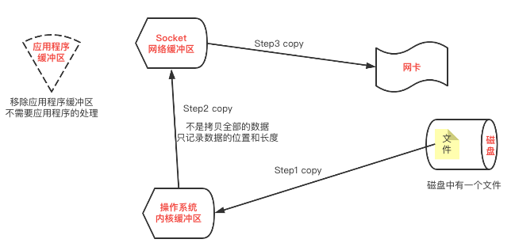

## 零拷贝

Netty成为网络框架的首选主要是因为它有三个特性：并发高、传输快、封装好。Netty能够支持并发高，在前面已经了解了，是因为使用了NIO的Selector(选择器)，已实现多路复用的模型。Netty能够支持传输快，实际上是应用了NIO的零拷贝的特性。数据的传输实际上就是搬运，从这个地方搬运到另一个地方，如何减少搬运的次数？如何减少CPU的使用？这些都是零拷贝产生过程中的不断摸索。

明确一点，拷贝机制不是我们的编程语言可以主导的，拷贝是操作系统层面的。我们通过Java去调用零拷贝，实际上也是操作系统的零拷贝机制。我们常说的零拷贝，实际上是Linux系统的零拷贝机制。

零拷贝解决的是这样的事情：将磁盘中的文件读取出来，通过socket发送出去。

### 传统的拷贝方式

将磁盘中的文件读取出来，通过socket发送出去。对于传统的拷贝要经过哪些步骤呢？

传统拷贝流程图如下：


如上图可知，传统拷贝方式经历了4次拷贝。

传统的I/O操作，会导致数据在操作系统和应用程序之间多次传输。对此进行优化，即减少传输次数，即较少CPU的使用。零拷贝就是避免CPU将数据从一块存储拷贝到另一块存储的技术。

```
IO中断，在IO设备处理数据的过程中，CPU和IO设备并行工作，当处理完一个数据时，需要CPU花费短暂的时间做中断处理，所以在一个指令结束时，中断使用的是CPU的处理时间。
```

**在操作系统中的拷贝（如①和②），叫做CPU拷贝。**
**连接磁盘或网卡等硬件的拷贝（如③和④），叫做DMA(直接存储器访问)拷贝。**

```
DMA=Direct Memory Accesss  直接存储器访问
数据传输的基本单位是数据块，在CPU与IO设备间每次至少传输一个数据块，申请的是总线的使用权，而传输的数据也是直接从设备传入内存中，只在传输开始和结束时才需要CPU的干预
```

**所谓零拷贝，是指在操作系统中的拷贝次数为0次，即CPU拷贝次数为0次。**

### 基于Linux支持的拷贝方式逐步优化传统拷贝为零拷贝

**零拷贝是基于操作系统层面的优化。**

* 优化1：我们说Socket网络缓冲区也属于操作系统的内核缓冲区，本质上就是从操作系统内核缓冲区又到了内核缓冲区，那么②③两步的两次拷贝，能不能减少呢？

  ```abap
  * mmap的拷贝方式：mmap = memory mapping 内存映射
     让应用程序缓冲区通过内存映射和操作系统内核缓冲区进行内存映射，从而减少了一次拷贝处理。
  ```

  
  此时文件复制到应用程序缓冲区进行处理，通过内存映射的方式替代了。减少了一次拷贝的次数。此时拷贝的次数为3词。

* 优化2：此时还是从内核缓冲区到内核缓冲区，只不过此时不经过应用程序了而已。那么Step2能不能进一步的优化呢？

  ```abap
  * sendfile(Linux2.1内核支持)
     优化1优化了从内核缓冲区到应用程序缓冲区的拷贝，
     优化2是优化从内核缓冲区到内核缓冲区的拷贝。
         优化2做的不是拷贝，而是记录数据所在的位置和长度（这极大的提高了Step2的拷贝速度），
         并且移除了应用程序缓冲区。
  ```

  
  此时在进行第三次copy的时候，本质上还是搬迁操作系统内核缓冲区中的数据，只不过Step2帮助我们记录了内核缓冲区中数据的位置和长度。虽然步骤还是三次，但是性能完全优于mmap的方式。

* 优化3：拓展sendfile的使用方式

  ```
  sendfile with scatter/gather copy （批量sendfile）
  原先是对文件层面的处理，现在是上升到多个物理地址的处理，提高处理速度。本质上处理方式没有发生变化。
  ```

* 优化4：终极解决方案：splice（拼接）

  ```abap
  * splice(Linux2.6内核支持)
       截止到目前，我们已经将应用程序缓冲区拿掉了，也将Step2进行了一定的优化。
       那么能不能进一步对Step2进行优化呢？
           可以的。
           不经历拷贝，通过管道的方式将操作系统内核缓冲区与Socket网络缓冲区连接起来。
  ```

  
  在操作系统内核缓冲区和Socket网络缓冲区之间建立管道，来减少拷贝次数。此时只需要两次拷贝即可完成文件的传输。同时这也是零拷贝（因为CPU拷贝的次数为0次)。

### 零拷贝的实现方式

#### mmap的拷贝方案

```java
/**
 * 通过mmap内存映射的方式实现文件拷贝
 *
 * @param sourceName 源文件
 * @param destName   目标文件
 * @throws IOException
 */
public static void copyByMmap(String sourceName, String destName) throws IOException {
  File source = new File(sourceName);
  File dest = new File(destName);
  if (!dest.exists()) {
    dest.createNewFile();
  }

  FileInputStream fis = new FileInputStream(source);
  FileChannel inChannel = fis.getChannel();

  FileOutputStream fos = new FileOutputStream(dest);
  FileChannel outChannel = fos.getChannel();

  // 为了实现inChannel和outChannel这两个通道的连通，使用MappedByteBuffer,是ByteBuffer的子类
  /**
   * 对应于mmap内存映射的拷贝方式
   */
  MappedByteBuffer buffer = inChannel.map(FileChannel.MapMode.READ_ONLY, 0, source.length());
  outChannel.write(buffer);
  buffer.clear();

  inChannel.close();
  fis.close();
  outChannel.close();
  fos.close();
}
```

#### sendfile的拷贝方案

```java
/**
  * 比mmap性能更高的拷贝方式 —— sendfile
  */
public static void copyBySendFile(String sourceName, String destName) throws IOException {
    File source = new File(sourceName);
    File dest = new File(destName);
    if (!dest.exists()) {
      	dest.createNewFile();
    }

    FileInputStream fis = new FileInputStream(source);
    FileChannel inChannel = fis.getChannel();

    FileOutputStream fos = new FileOutputStream(dest);
    FileChannel outChannel = fos.getChannel();

    // 将数据从inChannel搬迁到outChannel
    /**
      * 通过transferTo()方法可以直接将A通道数据搬运到B通道，都不需要Buffer。
      * transferTo方法声明：
      *     public abstract long transferTo(long position, long count, WritableByteChannel target)
      * @Param position 数据起始位置
      * @Param count 数据长度
      * @Param target 搬运位置
      *
      */
    inChannel.transferTo(0, inChannel.size(), outChannel);

    inChannel.close();
    fis.close();
    outChannel.close();
    fos.close();
}
```

#### 扩展some

既然Netty是引用了NIO底层的零拷贝的特性来提高传输速度的，那其他的中间件呢？比如Kafka，大数据消息处理的一种方式，Kafka也使用了零拷贝来提高传输效率。

