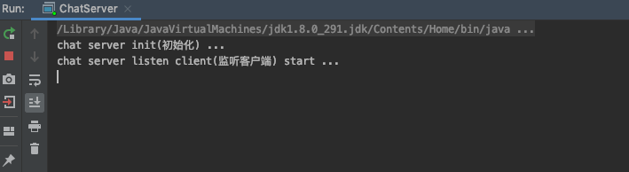
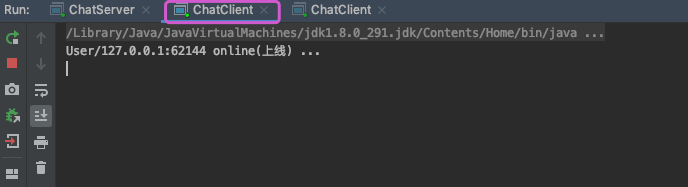
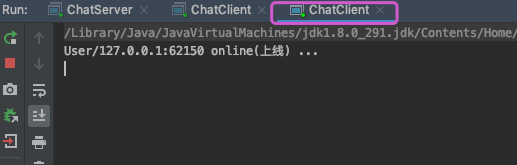
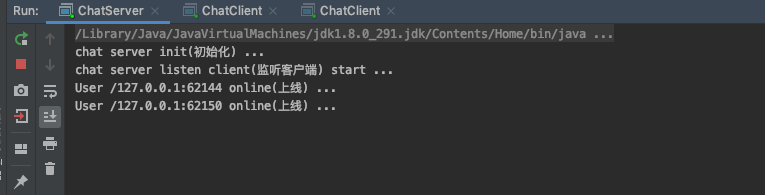
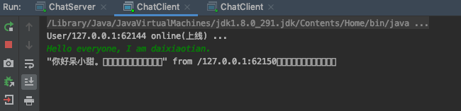
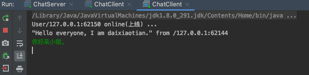
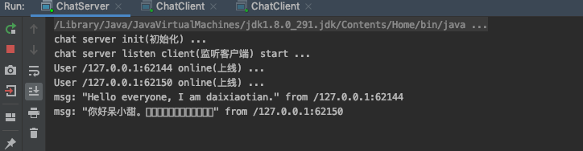
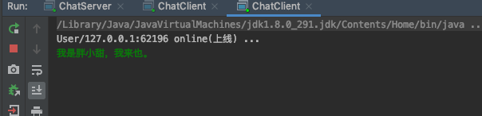
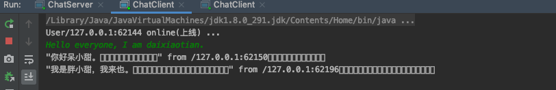
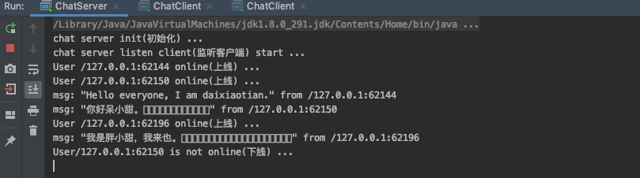

## NIO Demo —— 群聊系统

NIO解决的是数据传输的问题，我们可以基于NIO去实现一个群聊系统。

```
实现服务端和客户端之间的通讯（非阻塞）
1） 客户端发送数据，服务端能够一直接收。
2） 多个客户端发送的数据，彼此相互可见。
实际上，服务端做的就是广播数据给其他客户端（除了发送数据的客户端）
```

### 服务端代码

```java
package cn.zhoudbw.chat05;

import java.io.IOException;
import java.net.InetSocketAddress;
import java.net.SocketAddress;
import java.nio.ByteBuffer;
import java.nio.channels.*;
import java.util.Iterator;
import java.util.Set;

/**
 * @author zhoudbw
 * 群聊服务器
 */
public class ChatServer {

    /**
     * ServerSocket通道 服务端通道
     */
    private ServerSocketChannel serverSocketChannel;
    /**
     * 多路复用选择器
     */
    private Selector selector;

    /**
     * 初始化群聊服务器
     */
    public ChatServer() {
        System.out.println("chat server init(初始化) ...");
        try {
            // 初始化通道和选择器
            serverSocketChannel = ServerSocketChannel.open();
            selector = Selector.open();
            // 为服务器通绑定端口，IP就是本机
            SocketAddress address = new InetSocketAddress(1234);
            serverSocketChannel.socket().bind(address);
            // 设置通道是非阻塞的
            serverSocketChannel.configureBlocking(false);
            // 将通道注册到服务器，并指定SelectionKey为接收事件（初始化时首先应该是接收事件）
            serverSocketChannel.register(selector, SelectionKey.OP_ACCEPT);
        } catch (IOException e) {
            e.printStackTrace();
        }
    }

    /**
     * 服务端启动后，不断的监听是否有客户端进行连接 —— Selector就是个监听器
     * 监听客户端的变化
     */
    public void listenClient() throws IOException {
        System.out.println("chat server listen client(监听客户端) start ...");
        while (true) {
            // 询问选择器是否有事件要处理，通过select()，返回需要处理的事件数量
            int num = selector.select();
            if (num == 0) {
                continue;
            }
            // 获取需要处理事件的集合
            Set<SelectionKey> set = selector.selectedKeys();
            // 迭代需要处理的SelectionKey对应的事件
            Iterator<SelectionKey> iterator = set.iterator();
            while (iterator.hasNext()) {
                // 拿到迭代器中的一个SelectionKey，为避免重复使用，将其移除
                SelectionKey key = iterator.next();
                iterator.remove();

                // 识别key所对应的事件种类，并给予相应的处理
                /** 接收事件 */
                if (key.isAcceptable()) {
                    // 通过服务端通道接收客户端通道，此时socketChannel代表的就是连接服务器的客户端的Socket通道
                    SocketChannel clientChannel = serverSocketChannel.accept();
                    // 设置客户端Socket通道是非阻塞的
                    clientChannel.configureBlocking(false);
                    // 将客户端Socket通道注册到selector中，
                    // 对于用户来说，发送消息就是写消息，而对于我们服务端来说，用户发消息，我们就是读消息的操作
                    // 所以下一步开始监听读事件了
                    clientChannel.register(selector, SelectionKey.OP_READ);
                    // 客户端的Socket通道封装了Socket，通过Socket可以获取远程的IP和端口
                    System.out.println("User " + clientChannel.socket().getRemoteSocketAddress() + " online(上线) ...");
                    continue;
                }
                /** 读事件 */
                if (key.isReadable()) {
                    // 调用方法readData()处理读事件
                    readData(key);
                }
            }
        }
    }

    /**
     * 处理读事件的方法
     */
    private void readData(SelectionKey key) {
        // 获取被Selector选择器监听到的，发生读事件的通道
        // 这读事件是就我们服务端来说的，客户端将数据写入自己的Socket通道，我们从该客户端的Socket通道中读数据
        /**
         * 按照SocketChannel needReadChannel = (SocketChannel) key.channel()的写法获取SocketChannel会出现如下问题：
         * 如果该用户下线了，也就是获取到的SocketChannel为null，但是我们服务端这边在处理，这样就出现了问题。
         * 为了解决上述的问题，我们通过try...catch来捕获一下
         */
        SocketChannel needReadChannel = null;
        try {
            needReadChannel = (SocketChannel) key.channel();
            ByteBuffer buffer = ByteBuffer.allocate(1024);
            // 将数据读到buffer中，返回读取到的数据长度
            int num = needReadChannel.read(buffer);
            if (num > 0) {
                // 此时buffer内有数据，将buffer内的字节数组作为参数声明String
                String msg0 = new String(buffer.array());
                StringBuilder stringBuffer = new StringBuilder();
                for (int i = 0; i < num; i++) {
                    stringBuffer.append(msg0.charAt(i));
                }
                String msg = stringBuffer.toString();
                msg = "\"" + msg + "\" from " + needReadChannel.socket().getRemoteSocketAddress();
                System.out.println("msg: " + msg);

                // 将数据广播给其他的客户端，不包括发送数据的客户端本身
                // 调用sendToOther()方法广播消息
                sendToOther(msg, needReadChannel);
            }
        } catch (Exception e) {
            assert needReadChannel != null;
            System.out.println("User" + needReadChannel.socket().getRemoteSocketAddress() + " is not online(下线) ...");
            // 下线了需要取消在Selector选择器中的通道注册关系
            key.cancel();
            // 关闭通道
            try {
                needReadChannel.close();
            } catch (IOException ex) {
                ex.printStackTrace();
            }
        }
    }

    /**
     * 广播消息给其他的客户端
     *
     * @param msg               需要广播的数据
     * @param selfSocketChannel 发送数据的客户端通道（自身）
     */
    private void sendToOther(String msg, SocketChannel selfSocketChannel) throws IOException {
        // 发送给其他客户端 —— 找到所有的通道，排除自身通道，就是其他的客户端通道
        // 相当于找到所有在线的用户，通过选择器.key()方法获取所有的SelectionKey
        Set<SelectionKey> set = selector.keys();
        for (SelectionKey selectionKey : set) {
            // 获取SelectionKey对应的通道
            Channel channel = selectionKey.channel();
            // 判断：该channel需要是客户端的channel(用户) and 不能是发送消息的客户端(本身)
            if (channel instanceof SocketChannel && channel != selfSocketChannel) {
                SocketChannel otherClientChannel = (SocketChannel) channel;
                // ByteBuffer的另一种写入方式，直接通过wrap()方法将字节数组写入ByteBuffer中
                ByteBuffer buffer = ByteBuffer.wrap(msg.getBytes());
                // 将buffer中的数据写入到otherClient的SocketChannel中，
                // 只要其他的客户端读取通道中的数据就可以接收到数据
                otherClientChannel.write(buffer);
            }
        }
    }

    /**
     * 使用服务端
     */
    public static void main(String[] args) throws IOException {
        ChatServer chatServer = new ChatServer();
        chatServer.listenClient();
    }
}
```

### 客户端代码

```java
package cn.zhoudbw.chat05;

import java.io.IOException;
import java.net.InetSocketAddress;
import java.net.SocketAddress;
import java.nio.ByteBuffer;
import java.nio.channels.SelectionKey;
import java.nio.channels.Selector;
import java.nio.channels.SocketChannel;
import java.util.Iterator;
import java.util.Scanner;
import java.util.Set;

/**
 * @author zhoudbw
 * 群聊系统客户端
 */
public class ChatClient {
    private SocketChannel socketChannel;
    private Selector selector;

    /**
     * 初始化客户端
     */
    public ChatClient() {
        try {
            selector = Selector.open();

            SocketAddress address = new InetSocketAddress("127.0.0.1",1234);
            // 传递地址，直接将客户端绑定到IP和端口上
            socketChannel = SocketChannel.open(address);
            // 设置通道是非阻塞的
            socketChannel.configureBlocking(false);
            // 注册到选择器，客户端关心的是客户端发送过来的是什么，所以注册Read事件
            socketChannel.register(selector, SelectionKey.OP_READ);
            System.out.println("User" + socketChannel.getLocalAddress() + " online(上线) ...");
        } catch (IOException e) {
            e.printStackTrace();
        }
    }

    /**
     * 服务端是读数据
     * 客户端是写数据
     */
    public void sendData(String msg) {
        ByteBuffer buffer = ByteBuffer.wrap(msg.getBytes());
        try {
            socketChannel.write(buffer);
        } catch (IOException e) {
            e.printStackTrace();
        }
    }

    /**
     * 其他人说话了，服务端需要推送给客户端
     * 客户端需要读服务端传递过来的数据
     */
    public void readData() {
        // 监听到通道中有读事件发生
        try {
            int num = selector.select();
            if (num > 0) {
                Set<SelectionKey> set = selector.selectedKeys();
                Iterator<SelectionKey> iterator = set.iterator();
                while (iterator.hasNext()) {
                    SelectionKey key = iterator.next();
                    iterator.remove();
                    if (key.isReadable()) {
                        SocketChannel needReadChannel = (SocketChannel) key.channel();
                        ByteBuffer buffer = ByteBuffer.allocate(1024);
                        // 将数据写入到buffer中
                        int num1 = needReadChannel.read(buffer);
                        String msg0 = new String(buffer.array());
                        StringBuilder stringBuffer = new StringBuilder();
                        for (int i = 0; i < num1; i++) {
                            stringBuffer.append(msg0.charAt(i));
                        }
                        System.out.println(stringBuffer.toString());
                    }
                }
            }
        } catch (IOException e) {
            e.printStackTrace();
        }
    }

    /**
     * 连接客户端
     */
    public static void main(String[] args) {
        final ChatClient chatClient = new ChatClient();
        // 启动一个线程，有时间间隔的去通过readData()方法读取服务端传递的消息
        // 不支持显示创建线程，应当使用线程池，这里就不规范的写了
        new Thread() {
            @Override
            public void run() {
                while (true) {
                    chatClient.readData();
                    try {
                        Thread.currentThread().sleep(2000);
                    } catch (InterruptedException e) {
                        e.printStackTrace();
                    }
                }
            }
        }.start();

        /**
         * 写数据的时候，希望可以接收键盘的输入
         */
        Scanner scanner = new Scanner(System.in);
        while (scanner.hasNextLine()) {
            String str = scanner.nextLine();
            chatClient.sendData(str);
        }
    }
}
```

### 运行结果

* 启动服务端：
  

* 启动两个客户端：
  
  
  

* 一个客户端发送消息
  
  
  

* 一个客户端下线，一个客户端上线
  
  
  

  