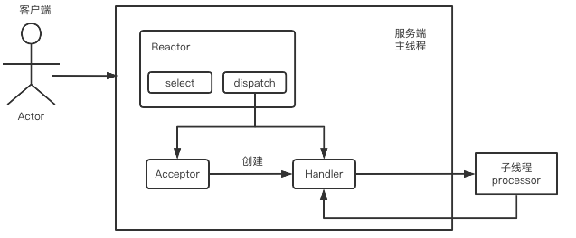
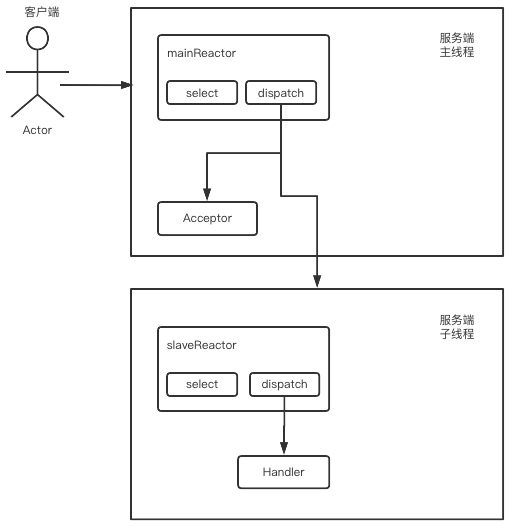

## NIO线程模型

线程模型是理解Netty的关键。原先我们的代码中有Selector选择器作为监听器，不断的监听事件的发生，一旦有事件发生了，先要识别事件的类型。如果是连接的类型，那么接收客户端的通道，随后将读或者写的事件注册选择器中。之后，我们再接收的就是读或者写的事件了。当读或者写事件发送过来的时候，我们继续按照读写事件的种类，通过ByteBuffer进行数据的处理。

这样我们可以看到事件的种类主要可以分为两类：建立连接的事件、读写事件。而且事件的发生顺序是有迹可循的。

* 事件的发生顺序
  
  首先是建立连接，然后进行读、然后进行写（读和写事件可以颠倒顺序)，写完了可以读，读完了可以写，知道断开连接。这是我们客户端和服务端交互一定要经历的顺序。
  那么我们能不能将"建立连接“抽象为一种处理器，将”读写事件"抽象为一种处理器呢？可以的。因为建立连接是accept()方法，所以抽象为Acceptor。而读写都是处理，所以抽象为Handler。
  所以就有了Reactor模型。

  ```
  Reactor模型，事件驱动，可以处理一个或多个数据源，通过多路复用将请求的事件分发给对应的处理器处理
  ```

* 在Reactor模型中，有三大核心角色：Reactor、Acceptor、Handler。

  ```
  Reactor 是选择器。Reactor：监听事件的发生，并分发给对应的Handler处理，或者分发给Acceptor（此时是没有创建Acceptor的，会创建Acceptor）。
  Acceptor是建立连接时要处理的逻辑；Acceptor： 处理客户端建立连接事件，并创建Handler，注册到选择器中，再需要时直接使用即可。
  Handler 是读写事件时要处理的逻辑。Handler：处理后续的读写事件。
  ```

  ### 单线程Reactor模型

  
  首先当客户端发起请求的时候，服务端有三大角色：Reactor、Acceptor、Handler。Reactor是整体的监听器（反应器)，通过select()方法不断的轮询看是否有事件发生；如果有事件，通过dispatch分发；分发会根据事件的种类分发到两种角色中，accept事件分发到Acceptor，读写事件分发到Handler中；其中，如果刚刚建立连接，此时还没有Handler，所以在刚建立连接时，Acceptor在处理的时候会直接创建一个Handler去注册到监听器中，后续有读写事件的时候就能够直接拿到Handler了，相当于建立了对应关系。
  这是最简单的单线程的模型，也叫做”单线程Reactor模型“。优点非常的明显：整个流程是非常的简单的。缺点也比较明显：对资源的利用率不高，特别是当Handler的处理过程较长的时候，整个流程会被阻塞住。
  在真实的实战场景中，Redis使用的就是这种单线程的Reactor模型。因为Redis整体的处理速度都非常的快，因为够快所以适合用单线程去处理。

  那么对于处理速度没那么快的场景用什么来处理呢？多线程Reactor模型。

  ### 多线程Reactor模型

  在单线程Reactor模型中，我们说Handler是我们最耗时的地方，如果我们一个Reactor、一个Acceptor、一个Handler在处理连接的时候，Handler在这里阻塞着，那么整个线程都在阻塞着，资源非常的浪费。那么能不能提高Handler的处理速度呢？或者让资源可以释放呢？在Handler中增加子线程。
  
  Handler自身可以通过线程池来提高处理速度。当事件被分发到Handler时，Handler从线程池中分配出一个子线程processor去处理该事件，处理完毕后子进程放回线程池。这种方案就称为“多线程Reactor模型”。

  本质是提高Handler的处理效率。首先Handler不在负责具体的业务逻辑，当读取出数据后，分发给子线程处理，子线程处理完成后，由于Handler需要整合结果，子线程将结果返回给Handler，Handler再将结果返回给客户端。这样我们就可以更加充分的利用CPU，提高资源的使用率。但是也因为我们使用了多线程，所以不可避免的会出现争抢资源的问题。

  再者，这里只有一个Reactor来监听或分发事件的，当我们的需求量再大一点的时候，Reactor也会成为性能瓶颈。

  ### 主从Reactor模型

  我们知道，Reactor主要是根据事件的不同分发到两个角色中，即Acceptor和Handler。Reactor当自身进行拆分的时候，其实也是可以按照事件的类别进行拆分的。
  
  当主Reactor(mainReactror)接收到accept事件的时候，就将其分发给Acceptor这个处理器；Acceptor在处理过程中，直接将后续的读写O事件注册给从Reactor(slaveReactor)。这么这就变成了mainReactor负责处理接收事件，slaveReactor负责处理读写的IO事件。这样就将事件按照主从Reactor进行了分流。这里mainReactor是一个主线程，slaveReactor是一个子线程。这样我们通过扩充Reactor又扩充了模型的支撑能力。

```ABAP
我们以一个小例子来说明上述三种模型：
* 我们将整个模型比作一个餐馆，Acceptor相当于前台的接待员，Handler相当于餐厅的服务员。
* 当我们去小的餐厅吃饭的时候，此时接待员和服务员都是同一个人，一直为我们服务。这就是单线程的Reactor模型。
* 当客流量增多了，这时候服务员不够用了，因为服务员要做的事情比较多，既要端茶又要送水。业务太多此时已经支撑不了太多的客户量了，为了支撑客户量的增多，我们增加服务员。这就是多线程Reactor模型。
* 当我们的客流量再进一步增长的时候，一个接待员也可能会有问题，所以增加多个接待员以及多个服务员，这样就可以接收更多的客流量了。这就是主从Reactor模型。
```

### 单线程Reactor模型的实现方式

```abap
ReactorServer.java
```

```java
package cn.zhoudbw.reactor06;

import java.io.IOException;
import java.net.InetSocketAddress;
import java.net.SocketAddress;
import java.nio.channels.SelectionKey;
import java.nio.channels.Selector;
import java.nio.channels.ServerSocketChannel;
import java.util.Iterator;
import java.util.Set;

/**
 * @author zhoudbw
 */
public class ReactorServer {

    /**
     * 在Reactor模型中：
     * 使用Selector对应角色Reactor 反应器 、通知器、 监听器
     */
    private Selector selector;
    /**
     * 作为服务端，需要有ServerSocketChannel
     */
    private ServerSocketChannel serverChannel;

    /**
     * 初始化Reactor
     */
    public ReactorServer() {
        try {
            // 获取选择器和服务端socket通道
            selector = Selector.open();
            serverChannel = ServerSocketChannel.open();
            // 设置通道为非阻塞的
            serverChannel.configureBlocking(false);
            // 为服务端通道绑定IP和端口。IP默认为本机的 端口8888
            SocketAddress address = new InetSocketAddress(8888);
            serverChannel.socket().bind(address);

            /**注册连接事件到selector的同时，声明一个Acceptor和事件绑定*/
            SelectionKey key = serverChannel.register(selector, SelectionKey.OP_ACCEPT);
            // 创建一个Acceptor, 用于处理SelectionKey.OP_ACCEPT事件，传递ServerSocketChannel和Selector作为属性
            Acceptor acceptor = new Acceptor(serverChannel, selector);
            // 将Acceptor作为一个附加对象进行绑定到SelectionKey上，当SelectionKey.OP_ACCEPT事件触发时，拿到Acceptor进行处理
            key.attach(acceptor);

            while (true) {
                int num = selector.select();
                if (num == 0) {
                    continue;
                }

                Set<SelectionKey> set = selector.selectedKeys();
                Iterator<SelectionKey> iterator = set.iterator();

                while (iterator.hasNext()) {
                    SelectionKey selectionKey = iterator.next();
                    iterator.remove();

                    // 通过attachment()方法，可以拿到attach()方法绑定的附加对象
                    //   如果事件是接收事件   分发给绑定的acceptor
                    //   如果事件是读写事件   分发给绑定的handler
                    /**因为有一个连接就需要创建一个Acceptor，所以Acceptor实现了Runnable接口*/
                    // Acceptor中run()方法中，处理接收事件，并且创建Handler，将Handler和读事件绑定在一起
                    // 所以在执行时如果有读事件，那么attachment()方法接收到的就是Handler，如果是接收事件那么就是Acceptor。
                    /**
                     * Acceptor的处理逻辑详见 run()方法
                     * Handler的处理逻辑详见  run()方法
                     */
                    Runnable runnable = (Runnable) selectionKey.attachment();
                    runnable.run();
                }
            }
        } catch (IOException e) {
            e.printStackTrace();
        }
    }
}
```

```abap
Acceptor.java
```

```java
package cn.zhoudbw.reactor06;

import java.io.IOException;
import java.nio.channels.SelectionKey;
import java.nio.channels.Selector;
import java.nio.channels.ServerSocketChannel;
import java.nio.channels.SocketChannel;

/**
 * @author zhoudbw
 */
public class Acceptor implements Runnable {

    private ServerSocketChannel serverChannel;
    private Selector selector;

    public Acceptor(ServerSocketChannel serverChannel, Selector selector) {
        this.serverChannel = serverChannel;
        this.selector = selector;
    }

    /**
     * ReactorServer端接收到accept()方法后，创建Acceptor线程处理相关事件。
     * Acceptor的处理接收事件的逻辑封装在run()方法中了。
     */
    @Override
    public void run() {
        try {
            // 通过serverChannel.accept()方法该连接事件的SocketChannel
            SocketChannel socketChannel = serverChannel.accept();
            // 设置该通道为非阻塞的
            socketChannel.configureBlocking(false);
            // 处理完接收事件之后，紧接着就会有后续的读写操作。这里将OP_READ事件注册到selector中。
            SelectionKey key = socketChannel.register(selector, SelectionKey.OP_READ);
            // 注册读写事件后，分发给Handler处理，Acceptor创建Handler，传递事件类型让Handler处理
            /**这里是只有一个Handler时候的处理方式*/
            Handler handler = new Handler(key);

            /**这里是使用多个Handler时候的处理方式*/
            /*MultiHandler handler = new MultiHandler(key);*/

            // Handler也是使用key.attach()方法和对应的SelectionKey绑定，这样就可以对应事件的类型
            // 通过attachment()方法，就可以拿到所需的对应的处理对象（要么是Acceptor，要么是Handler）
            key.attach(handler);

            // 注意：唤醒selector本身。因为原来的selector.select()方法是阻塞的。
            // 所以当我们这里处理完毕后，使用wakeup()方法唤醒阻塞。
            selector.wakeup();

        } catch (IOException e) {
            e.printStackTrace();
        }
    }
}
```

```abap
Handler.java
```

```java
package cn.zhoudbw.reactor06;

import java.io.IOException;
import java.nio.ByteBuffer;
import java.nio.channels.SelectionKey;
import java.nio.channels.SocketChannel;


/**
 * @author zhoudbw
 */
public class Handler implements Runnable {

    private SelectionKey key;
    private State state;


    @Override
    public void run() {

        /**
         * Handler是用来处理读写事件的。
         * 相应的Handler有两种状态。
         * 要么Handler对应读事件；要么Handler对应写事件。
         * 因此，Handler要分情况处理。
         */
        switch (state) {
            case READ:
                read();
                break;
            case WRITE:
                write();
                break;
            default:
                System.out.println("no status");
        }
    }

    /**
     * 通过内部的枚举类，来确定到底是读状态还是写状态。
     */
    private enum State {
        /**
         * READ  代表读的状态
         * Write 代表写的状态
         */
        READ, WRITE
    }

    /**
     * 初始化构造方法
     *
     * @param key 需要处理的事件所映射的SelectionKey
     *            初始化Handler的处理状态为读状态。
     */
    public Handler(SelectionKey key) {
        this.key = key;
        this.state = State.READ;
    }

    /**
     * 处理读事件
     */
    private void read() {
        ByteBuffer buffer = ByteBuffer.allocate(1024);
        try {
            SocketChannel channel = (SocketChannel) key.channel();
            int num = channel.read(buffer);
            String msg = new String(buffer.array());

            /**
             * 因为读写是可以循环的，
             * 而且在读事件发生之后，更加关注写事件，所以注册写事件
             * 读事件时也是同理。
             * 这样也就是实现了读写循环。
             */
            key.interestOps(SelectionKey.OP_WRITE);
            this.state = State.WRITE;

        } catch (IOException e) {
            e.printStackTrace();
        }
    }

    /**
     * 处理写事件
     */
    private void write() {
        // 将Hello直接写入ByteBuffer中
        ByteBuffer buffer = ByteBuffer.wrap("hello".getBytes());
        try {
            SocketChannel channel = (SocketChannel) key.channel();
            channel.write(buffer);
            key.interestOps(SelectionKey.OP_READ);
            this.state = State.READ;
        } catch (IOException e) {
            e.printStackTrace();
        }
    }
}
```

### 多线程Reactor模型的实现方式

* 主要区别在于修改了Handler的代代码
* 如果要使用多线程Reactor模型，直接在Acceptor中修改Handler的创建代码即可。

```abap
MultHandler.java
```

```java
package cn.zhoudbw.reactor06;

import java.io.IOException;
import java.nio.ByteBuffer;
import java.nio.channels.SelectionKey;
import java.nio.channels.SocketChannel;
import java.util.concurrent.ExecutorService;

/**
 * @author zhoudbw
 */
public class MultiHandler implements Runnable {

    private SelectionKey key;
    private State state;
    /**
     * 增加线程池来实现Handler分发多个子线程处理事件
     */
    private ExecutorService pool;

    private enum State {
        /**
         * READ  代表读的状态
         * Write 代表写的状态
         */
        READ, WRITE
    }

    public MultiHandler(SelectionKey key) {
        this.key = key;
        this.state = State.READ;
    }

    @Override
    public void run() {
        switch (state) {
            case READ:
                /**
                 * 读操作是非常耗时的，
                 * 使用线程池直接创建一个线程，去执行读的操作
                 * 相当于是将读的操作异步化了。
                 */
                pool.execute(() -> {
                    read();
                });
                break;

            case WRITE:
                write();
                break;
            default:
                System.out.println("no status");
        }
    }

    /**
     * 读事件，相对于Handler.java来说，处理逻辑没有发生变化
     * 只是调用的方式发生了变化，不再是同步的，而是异步的。
     */
    private void read() {
        ByteBuffer buffer = ByteBuffer.allocate(1024);
        try {
            SocketChannel channel = (SocketChannel) key.channel();
            int num = channel.read(buffer);
            String msg = new String(buffer.array());

            key.interestOps(SelectionKey.OP_WRITE);
            this.state = State.WRITE;

        } catch (IOException e) {
            e.printStackTrace();
        }

    }

    /**
     * 写事件
     */
    private void write() {
        ByteBuffer buffer = ByteBuffer.wrap("hello".getBytes());
        try {
            SocketChannel channel = (SocketChannel) key.channel();
            channel.write(buffer);

            key.interestOps(SelectionKey.OP_READ);
            this.state = State.READ;
        } catch (IOException e) {
            e.printStackTrace();
        }
    }
}
```

### 主从Reactor模型的实现方式

- 修改了ReactorServer.java为MultReactorServer.java，主要在于拆分Reactor为mainSelector和slaveSelector。
- 分别监听主Selector和从Selector的事件

```abap
MultiReactorServer.java
```

```java
package cn.zhoudbw.reactor06.masterslave;


import cn.zhoudbw.reactor06.Acceptor;

import java.io.IOException;
import java.net.InetSocketAddress;
import java.net.SocketAddress;
import java.nio.channels.SelectionKey;
import java.nio.channels.Selector;
import java.nio.channels.ServerSocketChannel;
import java.util.Iterator;
import java.util.Set;

/**
 * @author zhoudbw
 */
public class MultiReactorServer {

    /**
     * 使用Selector对应角色Reactor 反应器 、通知器、 监听器
     * 实现主从Reactor模型，将Selector拆分成mainSelector和slaveSelector分别对应主Reactor和从Reactor
     */
    private Selector mainSelector;
    private Selector slaveSelector;
    private ServerSocketChannel serverChannel;

    /**
     * 初始化主从Reactor模型
     */
    public MultiReactorServer() {
        try {
            // 获取主Reactor(Selector)和从Reactor(Selector)
            mainSelector = Selector.open();
            slaveSelector = Selector.open();
  
            serverChannel = ServerSocketChannel.open();
            serverChannel.configureBlocking(false);

            SocketAddress address = new InetSocketAddress(8888);
            serverChannel.socket().bind(address);

            // 将接收事件注册到主Selector中，并创建Acceptor对象，将其和接收事件进行绑定
            SelectionKey key = serverChannel.register(mainSelector, SelectionKey.OP_ACCEPT);
            /**
             * 注意此时将从Selector作为参数传递，因为在Acceptor的run()方法中，是将读事件绑定在传递的Selector中的。
             * 从Selector用于处理读写事件，因此将从Selector作为参数传递到new Acceptor()中。
             */
            Acceptor acceptor = new Acceptor(serverChannel, slaveSelector);
            key.attach(acceptor);

            /**
             * 从Selector使用独立的线程监听事件，避免相互阻塞
             * 使用new HandlerLoop(从选择器).run()方法后，其实相当于，
             * 该方法一直在监听从Selector是否有事件发生。在Acceptor的run()方法中，注册的是读事件
             * 因此该方法实际上是一直在监听是否有读事件的发生，
             * 如果有，那么会处理读事件，并且将写事件也attache()到对应的事件上去。
             * 那么此时监听的就是读和写事件了。
             */
            new HandlerLoop(slaveSelector).run();

            /**
             * 主Selector使用while(true)不停地监听事件
             */
            while (true) {
                int num = mainSelector.select();
                if (num == 0) {
                    continue;
                }

                Set<SelectionKey> set = mainSelector.selectedKeys();
                Iterator<SelectionKey> iterator = set.iterator();
                while (iterator.hasNext()) {
                    SelectionKey selectionKey = iterator.next();
                    iterator.remove();
                    // 拿到之前存储的附加对象
                    //   如果事件是接收事件   分发给绑定的acceptor
                    //   如果事件是读写事件   分发给绑定的handler
                    Runnable runnable = (Runnable) selectionKey.attachment();
                    runnable.run();
                }
            }
        } catch (IOException e) {
            e.printStackTrace();
        }
    }
}
```

```abap
HandlerLoop.java
```

```
package cn.zhoudbw.reactor06.masterslave;

import java.io.IOException;
import java.nio.channels.SelectionKey;
import java.nio.channels.Selector;
import java.util.Iterator;
import java.util.Set;

/**
 * @author zhoudbw
 * 用于监听从Selector
 */
public class HandlerLoop implements Runnable {

    private Selector selector;

    public HandlerLoop(Selector selector) {
        this.selector = selector;
    }

    /**
     * 线程未中断时，不停的监听是否有事件发生
     */
    @Override
    public void run() {
        while (!Thread.interrupted()) {
            try {
                int select = selector.select();
                if (select != 0) {
                    Set<SelectionKey> readKeys = selector.selectedKeys();
                    Iterator<SelectionKey> iterator = readKeys.iterator();
                    while (iterator.hasNext()) {
                        SelectionKey key = iterator.next();
                        Runnable runnable = (Runnable) key.attachment();
                        runnable.run();
                        iterator.remove();
                    }
                }
            } catch (IOException e) {
                e.printStackTrace();
            }
        }
    }
}
```